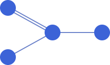

# v-network-graph

An interactive SVG based network-graph visualization component for Vue 3.

<p align="center">
  <br>
  
</p>

[Live examples](https://dash14.github.io/v-network-graph/examples/)


[](https://www.npmjs.com/package/v-network-graph)

[](https://www.npmjs.com/package/v-network-graph)
[](https://www.npmjs.com/package/v-network-graph)

## Features

* Create a graph according your reactive data dynamically
* Fully configurable appearance
* SVG based
* Pan and zoom viewport
* Drag nodes
* Multiple node selection
* Multiple edge selection
* Multi-touch support
* Various events are provided
* Export as SVG text

## Documentation

* [v-network-graph GitHub Pages](https://dash14.github.io/v-network-graph/)
  * [Getting Started](https://dash14.github.io/v-network-graph/getting-started.html)
  * [Examples](https://dash14.github.io/v-network-graph/examples/)
  * [Reference](https://dash14.github.io/v-network-graph/reference.html)

## Installation

Install with npm

```sh
npm install v-network-graph
```

and setup via Vue.use()

```js
import VNetworkGraph from "v-network-graph"
import "v-network-graph/lib/style.css"

Vue.use(VNetworkGraph)
```

## Basic usage

```vue
<template>
  <v-network-graph
    :nodes="nodes"
    :edges="edges"
  />
</template>

<script lang="ts">
import { defineComponent } from "vue"

export default defineComponent({
  setup() {
    const nodes = {
      node1: { name: "Node 1" },
      node2: { name: "Node 2" },
      node3: { name: "Node 3" },
      node4: { name: "Node 4" },
    }
    const edges = {
      edge1: { source: "node1", target: "node2" },
      edge2: { source: "node2", target: "node3" },
      edge3: { source: "node3", target: "node4" },
    }
    return { nodes, edges }
  },
})
</script>
```

For more examples, see [here](https://dash14.github.io/v-network-graph/examples/).

## Motivation and Design Policy

The requirements for visualizing network graphs are various, including
the design and user actions for each component such as nodes, edges,
paths, etc.
Many libraries have been made to flexibly achieve these numerous
requirements. However, many of these libraries have been around since
before Vue was launched, so there are not many libraries that can be
used with the concept of reactive programming. This means that using
these libraries together with Vue, you need to learn how to use the
graph libraries as well as Vue, and also having to design the
integration with Vue. These are probably a lot of efforts.

This component aims to make it easy to realize applications with these
various requirements while keeping the simplicity and reactive
programming style of Vue. Using the power of Vue (especially reactive
system and two-way binding), we hope to help developers quickly
visualize interactively manipulable network graphs with less code and
lower learning costs.

v-network-graph was designed with the following policy:

* Reactive

    All primitive data such as nodes, edges, node positions, and
    their styles are provided from outside the component, and the
    component can handle these data reactively with Vue. The
    developer can modify the data at any time to reactively perform
    manipulations such as adding/removing objects, moving node
    positions, changing appearance, etc.

* Highly customizable

    For visualizations, where the requirements vary widely from each
    application, it will be available a variety of customizations
    for ease of use. In addition to static specifications, it also
    supports dynamic changes due to the values ​​of fields contained
    in node and edge data.

* Extendable

    Network graphs have many types of visualization objects, and in
    many cases there are application-specific requirements. It is
    difficult to cover all the requirements with pre-defined
    functions. Therefore, we also implement a mechanism that allows
    developers to flexibly add their own SVG elements and actions
    as needed.

With the above, we would like to contribute to helping application
developers to focus on developing application-specific requirements
for handling network graphs.

## Contributing

If you find any bugs and/or want to contribute, feel free to submit issues or pull requests.

## License

Under the MIT license.  
See [LICENSE](https://github.com/dash14/v-network-graph/blob/main/LICENSE) file for more details.
